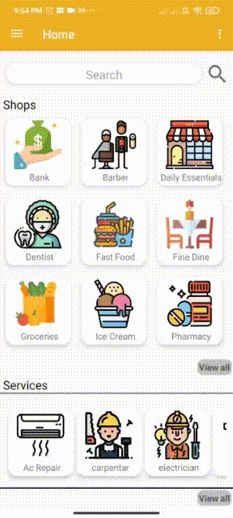
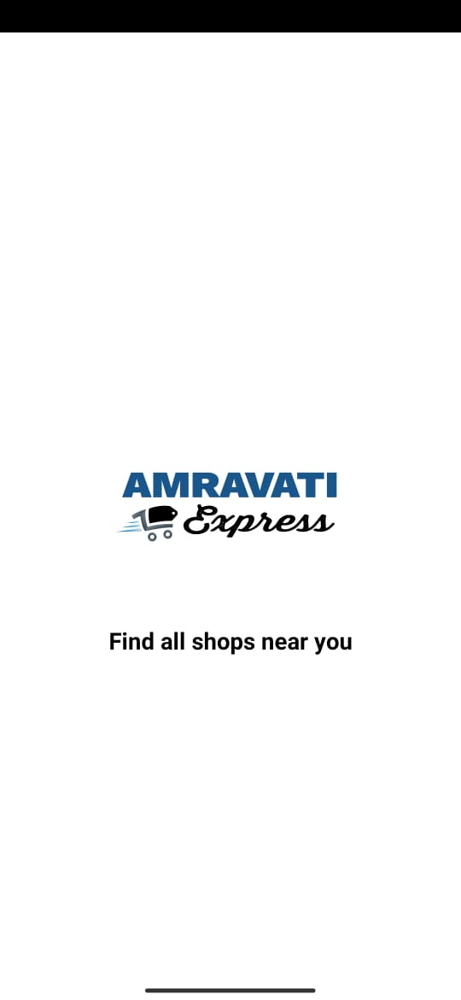
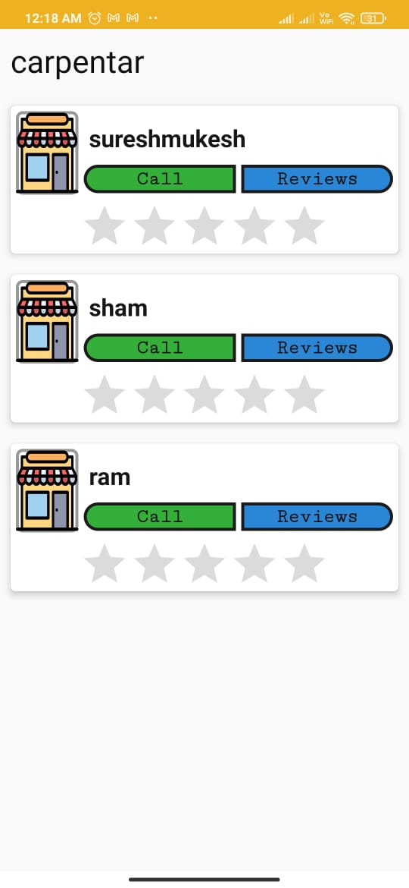

### README
 With times as dire as these, the necessity to stick to the four walls of our homes amongst our loved ones can't be looked over. Although it would seem that unlike the work and education sector finding a way to run themselves over the internet, households wouldn't be able to satisfy their needs with a mere tap of a few keys especially in small towns, yet this is exactly the opportunity to do something that is socially beneficial for the society while giving a boost to the routine businesses.
Thus, safety being the top priority- I have come up with a proposal of "Amravati Express" which  provides a platform for the vendors and customers to connect. It contains various details (like contact information, opening and closing hours, delivery options) of about 150 shops and services in Amravati Enclave Society and Dlf Valley Society.  The residents can stay safe at home and get the necessary services. Customers can also review and give ratings to the shops. This is going to be the MVP of the application.
 
After a small user base is created various other services like home delivery, booking services like(Gardner, ac-repair) from the app could be added.
### TECHNOLOGIES USED
  <code></code>
<code></code>
<code></code>
<code></code>
<code></code>

 

 
<table style="border:none;">
  <tr>
    <td><b>1. Basic Overview of the app <b></td>
    <td>2. App Logo </td>
  </tr>
      
  <tr>
    <td align="center"></td>
    <td  align="center"></td>
  </tr>
  
  <tr>
    <td><b>Various shops and services shown on the home screen <b></td>
    <td>4. You can contact the shopkeeper and also give reviews
     </td>
  </tr>
      
  <tr>
    <td align="center"></td>
    <td align="center"></td>
  </tr>
  

  

