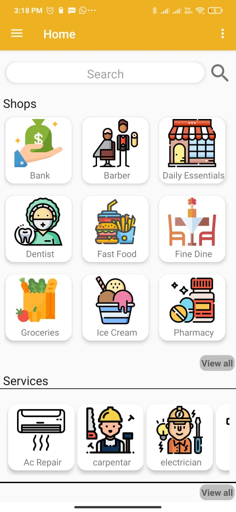

### README
 In covid times, people need to stay home as much as possible. But still, they may have to go out for daily essentials in their locality. Amravati Express provides a platform that connects vendors and customers.
It contains various details (like contact information, opening and closing hours, delivery options) of about 150 shops and services in Amravati Enclave Society and Dlf Valley Society.  The residents can stay safe at home and get the necessary services. Customers can also review and give ratings to the shops. This is going to be the MVP of the application.
 
After a small user base is created various other services like home delivery, booking services like(Gardner, ac-repair) from the app could be added.
### TECHNOLOGIES USED
Technologies used: •Android Studio• Java• Xml• Firebase• GoogelScript• Logo Designing• GoogleSheets
 

 
 ### MAIN SCREEN 
 The Main Screen of app looks like this: 
 
  

